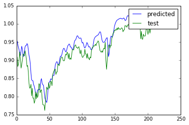
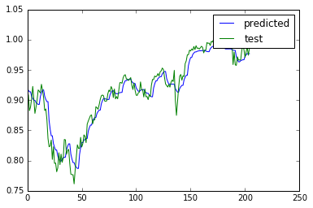

#股指预测实验重现
参考论文：（Bao W, Yue J, Rao Y. A deep learning framework for financial time series using stacked autoencoders and long-short term memory[J]. PloS one, 2017, 12(7): e0180944.）

---
###数据源：[股指数据](figshare.com/s/acdfb4918c0695405e33) （RawData.xlsx）
每个市场包含2类数据 一个是index data 另一个是index future data 用于对比实验。

不同市场间的数据在时间维度上具有差别。CSI300 没有宏观经济因子。

---
###小波变换

文中的描述：When the financial time series is very rough, the discrete wavelet transformation can be applied repeatedly by which the risk of overfitting can be reduced. As a result,  **the two-level wavelet is applied twice** in this study for data preprocessing.

文中小波变换的过程参考的是

[Forecasting stock markets using wavelet transforms and recurrent neural
networks: An integrated system based on artificial bee colony algorithm]()

且文中使用的是小波簇为 **Haar**， 进行离散小波变换DET， 由于金融时间序列的不稳定性(rough) 所以进行两次变换（2-level）防止过拟合的发生。
（换句话说使用小波变换是为了使RMSE最小）

python 小波变换库 Pywalvets。[Pywalvets 学习笔记](http://blog.csdn.net/nanbei2463776506/article/details/64124841)

相关的使用介绍 [python小波工具箱](http://blog.csdn.net/alwaystry/article/details/52756051) 

---
### SAE 结构

[自编码器之间的差异](https://www.zhihu.com/question/41490383)

[Stacked Auto-Encoder搭建](https://www.cnblogs.com/tornadomeet/archive/2013/04/09/3011209.html)

[2号模型](http://blog.csdn.net/freeliao/article/details/19618855)

[3号模型 使用Tensorflow实现Denoising Auto-Encoder](http://blog.csdn.net/u013719780/article/details/53908852)

---

### LSTM结构

使用LSTM 建立回归模型 [Sequence prediction using recurrent neural networks(LSTM) with TensorFlow](http://mourafiq.com/2016/05/15/predicting-sequences-using-rnn-in-tensorflow.html)
**|**  [GitHub](https://github.com/mouradmourafiq/tensorflow-lstm-regression)（预测模型基于此源码建立完成）

图片分类模型[TensorFlow入门（五）多层 LSTM 通俗易懂版](http://blog.csdn.net/jerr__y/article/details/61195257)

---

###混合模型

结果：

使用S&P500 进行的预测

####LSTM [Predict_LSTM.py]()： 
MSE为 0.000845
 
图

####WLSTM [Predict_WLSTM.py]():
MSE为 0.000242

图 