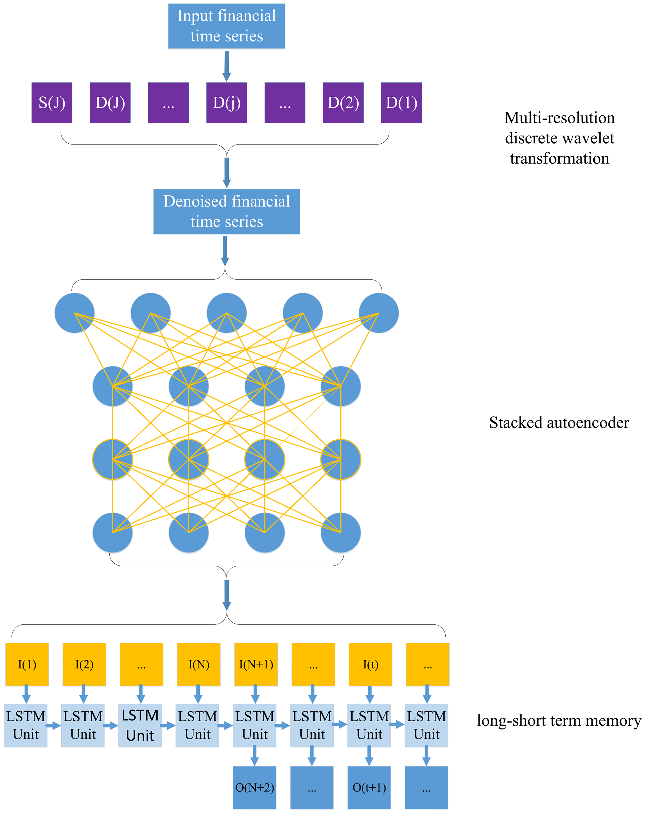
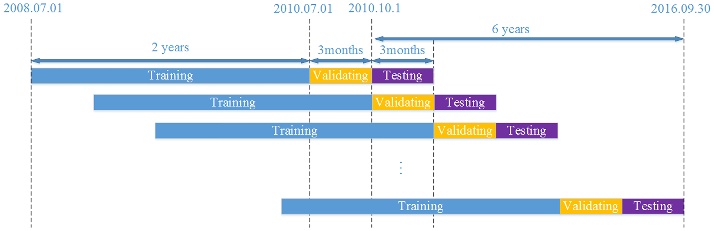

# 文章记录

## 标题
### A deep learning framework for financial time series using stacked autoencoders and longshort term memory

## 摘要
文章使用了一个基于**小波变换**(Wavelet Transforms),**栈式自编码器**（stacked autoencoders) 和 **长短时记忆网络**(LSTMs)的混合模型用于6个不同的股指市场预测中。并从预测精度与交易收益两个方面进行模型评估。

## 模型结构

* 使用两次小波变换进行去噪处理
* SAE中为5层结构，输入维度在18-25之间，隐层的节点数为10.
	> 模型参考于	
	> **Deep Learning-Based Classification of Hyperspectral Data**
* LSTM的参数选择通过实验获得。隐层数为5，延迟(delay)为4。训练集：验证集：测试集为 80%：10%：10%。 学习率为0.05，batch size为60，迭代5000

## 实验设计

1. 数据源
	* 来自于 [WIND database](http://www.wind.com.cn)、[CSMAR database](http://www.gtarsc.com)、和 Investing.com.
	* 实验数据可以在[Figshare website](figshare.com/s/acdfb4918c0695405e33)中得到
	* 包括(发展市场) CSI 300, Nifty 50 , (新兴市场) Hang Seng index, Nikkei 225,(发达市场)S&P500,DJIA index。 6个不同市场经济的指数。
	* 三种输入参数。交易指标：Open,High,Low,Close。技术指标：MACD，CCI，ATR，BOLL，EMA20，MA5/10, MTM6/12, ROC, SMI, WVAD。 宏观指标：汇率与利率。
2. 时间划分
	* 实验中使用两年数据作为训练集，1个季度数据为验证集，1个季度数据为测试集。重复24次，测试集跨度为2年。
	

3. 表现测量
	* 精度(MAPE,R,Theil U):
	
		
	* 交易策略： 买入信号`y'(t+1) > y(t) `。 卖出信号 `y'(t+1) < y(t)`
	* 交易收益：

		
4. 结果 
	* 看论文